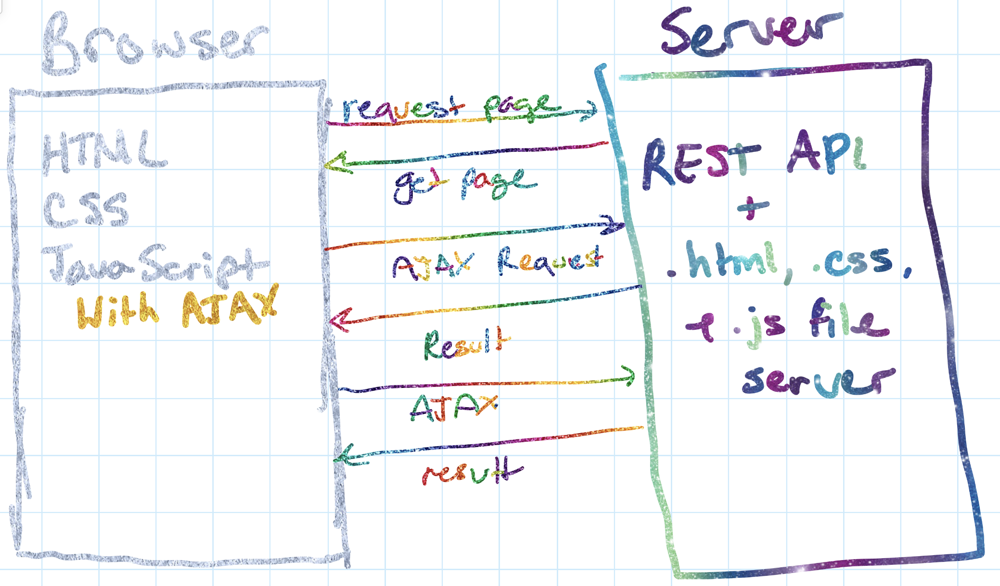
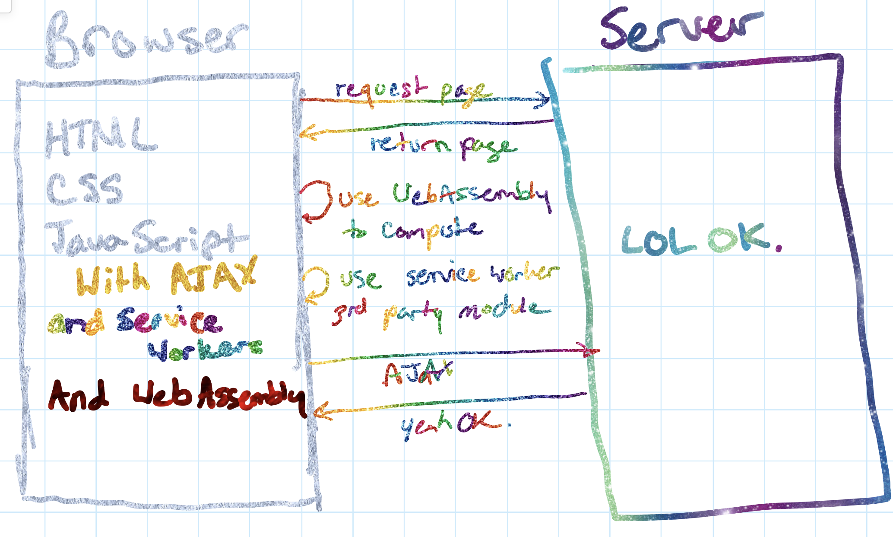

## V8, WebAssembly, and the **Future of JS and a Multi-Language Web**

---

## About Me


* Robotics Author/Addict
* Developer 🥑
* Twitch streams hardware/software @nodebotanist

---

## CatParent


---

#[fit] What even is **WebAssembly**?  

---

## What WebAssembly is *NOT*

* a programming language
* the death of JS
* something you can just ignore cause it's gonna go away


---

## What WebAssembly *is*

* A compilation target for other languages to compile to
* An augmentation of the abilities of JS
* But most importantly...

---

* Pretty literally* **magie**


\* - no not really literally but I'll explain later

---

# WebAssmebly is a compilation target

* You write code in other languages and compile them into WebAssembly
* Rust, C/C++, Go, C#; these are just a few of the languages with WebAssembly as a compile target

---

## But the question you then have to ask is...

---


---


---

## There are *so many reasons* you would want this in your life

---

# THIS IS *THE NEXT AJAX* FOR THE BROWSER

---


---

# No but seriously

Ajax lent a huge credibility to browser applications, and WebAssembly is an evolution of that.


---


---


---



---



---


---

## Why does this matter?

* Augmenting JS at its not-so-strong points
* Not rewriting entire codebases to use them on the web
* Fewer calls to the server, less latency, faster web apps

---

## Augmenting JS at its not-so-strong points

`0.1 + 0.2 === 0.3 //false`

If you're running *anything that relies on mathematical numerical accuracy* that meant, until now, another AJAX call to have another language do alllllllll the math. *With WebAssembly*, we can do this in the browser, with, say, Rust.

---

## Other JS not-so-strong points

* Type coercion side-effects: `"" == 0 //true`
* API Overloads:

```
1 + document.getElementById("inputElem").value; // Concatenates
1 + Number(document.getElementById("inputElem").value); // Adds
```

* The mystery that is `typeof`

```
typeof {} === "object" //true
typeof "" === "string" //true
typeof [] === "array"; //false
```

---

## Using WebAssembly means *using the right tool for the job*

---

# BUT THIS WILL KILL JS!!!


---

### No, it *makes JS better* by letting it do what it is good at and ignoring the rest.

---

## It *makes the web better* by creating better browser experiences


---

# Let's *take a closer look* with a demo

---

# The Demo

* uses wasm-imagemagick
* manipulates images in the browser up to 10x faster than JS can
* Shows the real power of not having to rewrite code and being able to let us use the right tool for the job

---

# But what about *Node.JS*?

---

# Wait...

---

# What *ABOUT* Node.JS?!?!


---

# Native. Heccin. Modules.


---

# Why native modules are such a pain

* They have to be recompiled on download
* They either have to compile on every platform OR leave off platforms from support
* Node-Gyp (disclaimer: I respecc the hecc out of their work.)

---

# WebAssembly *Works on Node >= 8.0*

---


---

# WebAssembly Modules in Node.JS

* Are *precompiled for Node.JS*, so they're portable to *any platform that runs Node.JS*.
* No more recompilation on every download on every architecture.
* FOR REALS.

---

> "Everyone wants to [deprecate] node-gyp and WebAssembly would allow us to do this"
-- Laurie Voss, this morning

---

# WebAssembly is even invading serverless


---

# We have a free tier now!


(I'll show this again later and it's at our booth)

---

# The point of this talk

* Try WebAssembly (I personally really like Rust)
* WebAssembly is the future of JS in all its forms
* If you are a hiring manager; hire someone who is different from you. Just go and do it.

---


---

# Thanks for listening!


* kas@cloudflare.com
* @nodebotanist
* Search meetup.com for 'Serverless' for a meetup on Tues here in Singapore where you can learn to write a worker


